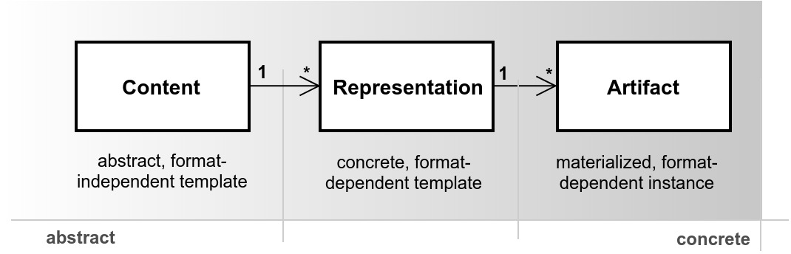
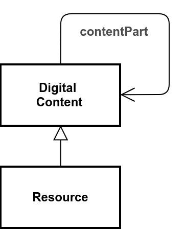

# Content Module

`Digital Content` is the core class of this module, the notion of a standalone content available in a machine processable, binary way. There are few subclasses defined, varying with regard to the audience (`Text` vs. `Software`), sensory requirements (`Audio` vs. `Image`) or structure (`Text` vs. `Data`). Further differentiation of the type, genre or purpose of content is done by `Content Type` annotations. The `Digital Content` is modeled at three levels of detail, i.e. the meaning (`Digital Content` itself), the shape (`Representation`) and an individual materialization (`Artifact`). Such a layered content model allows for a gradual concretisation, starting at general content aspects of `Provenance`, `Context`, or semantic `Concept`s. At the next, optional level `Representation` details of its physical constitution are specified, such as data format, dimensions or frame rate enabling its processing. No, one, or multiple `Representation`s may be specified with a single `Digital Content`. The `Artifact` layer finally deals with a particular instance of a content `Representation` materialized at a particular point in time. It exhibits properties like a file name, size, and creation time stamp. There may be any number of `Artifacts` derived from a `Representation`. 

The `Digital Content` class allows for expressing of nested, potentially interesting constituents via the `contentPart` predicate. Next to describing such structured contents, there is often a need to model collections of related contents existing in parallel. The notion of `Resource` was introduced to distinguish a defined top-level content (root resource) which is optionally differentiated vertically or horizontally. In combination with the *Communication* and *Commodization* modules a `Resource` represents a single or set of logically related `Digital Content`(s) provided at particular conditions (by means of a defined `Interface`) via protocol-specific `Endpoint`s. 

