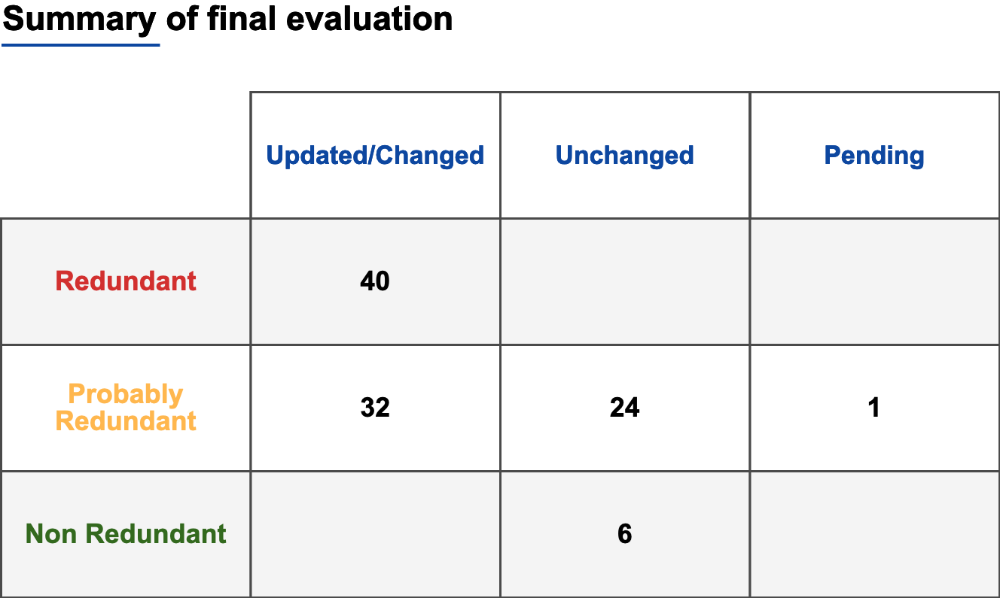
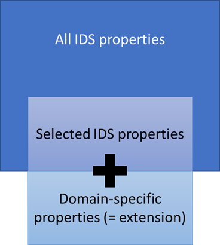

# Reusability and Domain-specific Extensions Through Application Profiles (T60)

## Introduction

In the IDS Information Model we reused many classes and properties initially defined in other external ontologies. However, we identified possible redundant local definitions of classes and properties. Therefore, we decided to analyze those definitions and determine suitability of their local definition. After the performed analysis, we decided to remove those redundant definitions and directly use the external properties in our SHACL shapes instead.

Software engineers and other users might directly jump to the **hands-on manual** presented below.

## Goal

Our goal was to effectively identify and remove all redundant definitions of classes and properties, and directly use external definitions from existent ontologies.

<details><summary>Methodology</summary>
<p>

First, we created a new branch from the *"develop"* branch. After that, we created a list of every external class and property used in the IDS Information Model and evaluated if the use of the property or class was redundant. For that, we considered the following definitions:

- **Redundant (r)** The internal definition of a class or property does not add any additional information to the already external definition.
- **Partially Redundant (pr)**  The internal definition of a class or property adds some level of specificity.
- **Non-redundant (nr)**: The internal definition of a class or property adds new information or more specificity, such as domain and range or further constraints.

Our approach for identifying possible redundant definitions was to search in files by using regular expressions: `subClassOf(?!ids)`, and `subPropertyOf(?!ids)`. We traversed all the results and ignored copies of ontologies. Moreover, we focused on the *.ttl* files included in the different model definitions, for example **communication**, or **content**.

Once we found these results, we listed each class and property by file, the relation (`subClassOf or subPropertyOf`), and the external class or property it refers to.  For the aforementioned evaluation (**r**, **pr**, **nr**), we analyzed the internal definition, for example, which other additional information was introduced by it. We then determined the use of that internal definition in the related files in the models, validations, and testing files. Based on the performed evaluation, we made the decisions to keep the class or property, or remove it and proceeded to the concrete implementation of changes as described in the next section.

We describe some examples here:

- The `ids:Agent` is defined as an extension of the `odrl:Party`, indeed `ids:Agent` is defined as a `subClassOf odrl:Party`. We took the following notes: "It is not clear why ids:Agent needs to be defined as a subclass of two external classes. Based on the information on the **ODRL vocabulary**, `foaf:Agent` needs to be used to describe further details of the party. Additionally, to `odlr:Party` and `foaf:Agent`, it is defined as a subclass of `ids:Described` and adds only `rdfs:label` and `rdfs:comment`. It is used in *Participant.ttl* to define `ids:Participant`, and to define range for `ids:publisher`, and `ids:sovereign` in *Resource.ttl*, `ids:senderAgent` and `ids:recipientAgent` in *Message.ttl*, and `ids:hasAgent` in *Connector.ttl"*. Based on those evaluation notes, we decided the definition in the IDS Information Model was **Redundant (r)**, removed the `ids:Agent` and replaced it by `foaf:Agent`.


- The `ids:contentType` is defined as a `subPropertyOf` `dct:type`, and it adds `rdfs:domain` (ids:DigitalContent), and `rdfs:range` (ids:ContentType). We decided that this definition was **Partially Redundant (pr)**, but we decided to keep it, as it is more specific than `dct:type`.


- The `ids:includedCertificationLevel` is defined as a `subPropertyOf` `dct:isPartOf`. It adds `rdfs:label`, `rdfs:comment`, `rdfs:seeAlso`, `rdfs:domain` (ids:CertificationLevel), and `rdfs:range` (ids:CertificationLevel). We noticed that it is only used in codes and in validations. In codes, it is used to define `idsc:PARTICIPANT_ENTRY_LEVEL_MANAGEMENT_SYSTEM`, `idsc:PARTICIPANT_MEMBER_LEVEL_MANAGEMENT_SYSTEM`, and others. And it is used to define validations in *CertificationShape.ttl*.

</p>
</details>

<details><summary>Implementation</summary>
<p>

- For the implementation of the first given example, we modified the following files in the model: *Message.ttl*, *Resource.ttl*, *Connector.ttl*, *Participant.ttl*. We added `@prefix foaf: <http://xmlns.com/foaf/0.1/>` to each of those files, and replaced `ids:Agent` by `foaf:Agent`. Moreover, we removed the definition of `ids:Agent` in *Participant.ttl*. In the testing files, only `sh:message` was modified and the commented code referencing `ids:Agent` was removed in *MessageShape.ttl*, *ResourceShape.ttl*, and *ConnectorShape.ttl*.
- For the second example, as the internal definition was more specific, no changes were implemented.
- Lastly, for the third example, We decided to keep it, and therefore no changes were implemented.

</p>
</details>

<details><summary>Documented GitHub Issues</summary>
<p>

Here we list the issues related to the evaluation and implementation of changes.

- The initial requirement was the following:
  [Issue #413 - Remove redundant class/property definitions whenever external concepts can be used directly](https://github.com/International-Data-Spaces-Association/InformationModel/issues/413)

- For that, first we evaluated the **Redundant (r)**, **Partially Redundant (pr)**, and **Non-Redundant (nr)** classes and properties, based on the following issue:
  [Issue #461 - List and evaluate every usage of external classes or properties](https://github.com/International-Data-Spaces-Association/InformationModel/issues/461)

- For the implementation of changes, we refactor the IDS Information Model, and included all the changes under the following issue:
  [Issue #504 - Refactor ids model enhancement (directly reuse external concepts instead of copying)](https://github.com/International-Data-Spaces-Association/InformationModel/pull/504)

- Moreover, we included a helper file to support the CodeGen tool. It can be found under the issue:
  [Issue #490 - Refactor identified refactoring options for the IDS information model](https://github.com/International-Data-Spaces-Association/InformationModel/issues/490)

</p>
</details>

<details><summary>Impact</summary>
<p>

After making the aforementioned evaluation and changes, the results are the following:

- SHACL shapes were revised, in which obsolete IDS classes and properties have been replaced by directly using those from external ontologies. Link: [Revised SHACL shapes](https://github.com/International-Data-Spaces-Association/InformationModel/pull/504/files?authenticity_token=XVFNq4XvnDG%2B7RiaW4dajYrPiYhNvJduQR6iBOrESAomY91dmV4lzg2WjUWMB3c3cGYFzHUesT95PDoMD2eqkg%3D%3D&file-filters%5B%5D=.ttl&hide-deleted-files=true&w=1)
- The IDS infomodel has been improved. Link: [Revised infomodel](https://github.com/International-Data-Spaces-Association/InformationModel/pull/504/commits)
- A dedicated helper file, which compensates for the copies deleted from the infomodel and thus makes them available to the CodeGen environment, has been developed. This contains a minimal set of all the resources needed to keep code generation stable and reliable. Link: [Dedicated helper file](https://github.com/International-Data-Spaces-Association/InformationModel/blob/documentationIDSModel-enhacement/utils/refactor_helper.ttl)

- 103 definitions were evaluated, from which 36 were classes and 67 were properties.
- We detected 57 **Probably Redundant (pr)** cases, 40 **Redundant (r)** cases, and 6 **Non Redundant (nr)** cases.
- In 30 cases we made no changes, from which 6 correspond to **Non-Redundant (nr)** cases and 24 correspond to **Partially Redundant (pr)** cases.
- In 72 cases we made changes by removing the local definitions and replacing them by their external definitions, they all correspond to **Redundant (r)** and **Partially Redundant (pr)** cases.
- 1 case is pending, and corresponds to the property **"ids:rightOperand"**

We summarize the results of our evaluations as follows:



</p>
</details>

<details><summary>Hands-on Manual</summary>
<p>

To use the IDS Information Model, the steps to consider are the following:

1. Decide what to model.
2. Use the IDS Information Model as a basis for describing the different components.
3. Extend the IDS Model with the local definitions and restrictions.



To illustrate the above-mentioned steps we consider an example as follows:

1. Consider you want to model a general **Resource** which can be later defined more specifically.

2. The first step would be to consider the class definition and properties already defined in the **IDS Information Model** (available in *../model/content/Resource.ttl*).
See also the following snippet:

```
# Class Definition
ids:Resource
    a owl:Class;
    rdfs:subClassOf ids:DescribedSemantically, ids:DigitalContent, # e.g., Collection Resource contains sub-resources but also has an own Representation
        ids:ManagedEntity, odrl:Asset ;
    rdfs:label "Resource"@en ;
    rdfs:comment "Resource is a single digital content or a coherent set of digital contents. Resource content is formalized in Representations and optionally materialized as Artifacts. The Resource's content is exposed via defined Interfaces at various protocol Endpoints."@en;
    rdfs:seeAlso <https://www.w3.org/TR/vocab-dcat/#class-dataset>;

```

```
# Properties definition

ids:resourcePart a owl:ObjectProperty;
    rdfs:subPropertyOf ids:contentPart;
    rdfs:label "resource part"@en;
    rdfs:domain ids:Resource;
    rdfs:range ids:Resource;
    rdfs:comment "Reference to a Resource (physically or logically) included, definition of part-whole hierarchies."@en .

ids:resourceEndpoint
    a owl:ObjectProperty;
    rdfs:label "resource endpoint"@en;
    rdfs:domain ids:Resource ;
    rdfs:range ids:ConnectorEndpoint;
    rdfs:comment "Reference to the Endpoints that serve the resource's content or let you exchange messages with an IDS Connector."@en.

ids:contractOffer
    a owl:ObjectProperty;
    rdfs:domain ids:Resource;
    rdfs:range ids:ContractOffer;
    rdfs:label "contract offer"@en;
    rdfs:comment "Reference to a Contract Offer defining the authorized use of the Resource."@en.
    
ids:sovereign
    a owl:ObjectProperty ;
    rdfs:domain ids:Resource ;
    rdfs:range foaf:Agent ;
    rdfs:label "sovereign"@en;
    rdfs:comment "The 'owner', i.e. sovereign of the data."@en.
.
.
.

```

The prefix `ids` is defined locally in the **IDS Information model** by `@prefix ids: <https://w3id.org/idsa/core/> .`

We can observe that an `ids:Resource` has a label (`rdfs:label`) and a comment (`rdfs:comment`). From the properties we know that an `ids:resourcePart` is in the domain of an `ids:Resource`, meaning that any resource with this property is an instance of a Resource. The same reasoning can be applied to the properties `ids:resourceEndpoint` and `ids:contractOffer`. Further properties are defined in the domain of a Resource, but will be omitted in this example.

Now we consider the validations already included in the **IDS Information model** (available in *../testing/content/ResourceShape.ttl*).
See also the following snippet:

```
shapes:ResourceShape
	a sh:NodeShape ;
	sh:targetClass ids:Resource ;

	sh:property [
		a sh:PropertyShape ;
		sh:path ids:resourcePart ;
		sh:class ids:Resource ;
		sh:severity sh:Violation ;
		sh:message "<https://raw.githubusercontent.com/International-Data-Spaces-Association/InformationModel/master/testing/content/ResourceShape.ttl> (ResourceShape): An ids:resourcePart property must point from an ids:Resource to an ids:Resource."@en ;
	] ;

	sh:property [
		a sh:PropertyShape ;
		sh:path ids:resourceEndpoint ;
		sh:class ids:ConnectorEndpoint ;
		sh:severity sh:Violation ;
		sh:message "<https://raw.githubusercontent.com/International-Data-Spaces-Association/InformationModel/master/testing/content/ResourceShape.ttl> (ResourceShape): An ids:resourceEndpoint property must point from an ids:Resource to an ids:ConnectorEndpoint."@en ;
	] ;

	sh:property [
		a sh:PropertyShape ;
		sh:path ids:contractOffer ;
		sh:class ids:ContractOffer ;
		sh:severity sh:Violation ;
		sh:message "<https://raw.githubusercontent.com/International-Data-Spaces-Association/InformationModel/master/testing/content/ResourceShape.ttl> (ResourceShape): An ids:Resource must have at least one ids:ContractOffer linked through the ids:contractOffer property"@en ;
	] ;
    
    	sh:property [
		a sh:PropertyShape ;
		sh:path dct:publisher ;
		sh:nodeKind sh:IRI ;
		sh:maxCount 1 ;
		sh:severity sh:Violation ;
		sh:message "<https://raw.githubusercontent.com/International-Data-Spaces-Association/InformationModel/master/testing/content/ResourceShape.ttl> (ResourceShape): A dct:publisher property must not have more than one point from an ids:Resource to an foaf:Agent."@en ;
	] ;

	sh:property [
		a sh:PropertyShape ;
		sh:path ids:sovereign ;
		sh:nodeKind sh:IRI ;
		sh:maxCount 1 ;
		sh:severity sh:Violation ;
		sh:message "<https://raw.githubusercontent.com/International-Data-Spaces-Association/InformationModel/master/testing/content/ResourceShape.ttl> (ResourceShape): An ids:sovereign property must not have more than one point from an ids:Resource to an foaf:Agent."@en ;
	] ;

```

In the validations, more specifically in `ids:resourcePart` we observe that the resource part must belong to the class `ids:Resource`, the same applies for `ids:contractOffer`. However, both of them are not mandatory.

Additionally, we see that the property `dct:publisher` is not mandatory but if that information is included, the `ids:Resource` can have at most 1 `dct:publisher`, and the same applies for `ids:sovereign`.

Now, let's say we want to model resource, with a new prefix ap15 (`@prefix ap15: <http://fit.fraunhofer.de/ap15/> .`) as follows:

```
ap15:Ressource1
    a                    ids:Resource ;
    dct:title            "Überpunkt/Hauptbeschreibung"@de ;
    dct:description      "Ein Satz in natürlicher Sprache, der die Ressource beschreibt."@de ;
    ids:resourceEndpoint [ a             ids:ConnectorEndpoint ;
                           ids:accessURL <https://link-zum-endpunkt> ; ] ;
    dcat:keyword          "AAS", "keyword2", "keyword3" ;
    ids:resourcePart     ap15:Instandhaltungskennzahlen1, ap15:UeberwachungerelevanteKennzahlen1, ap15:Lebenserwartung1 ;
    dct:publisher        <http://iml.fraunhofer.de> ;
    ids:sovereign        <http://iml.fraunhofer.de> ;
    dct:issued           "2021-04-06T17:30:00.000+02:00"^^xsd:dateTimeStamp ;
    dct:modified         "2021-04-06T17:30:00.000+02:00"^^xsd:dateTimeStamp ;
    ap15:serialNumber               "abc12345" ;
    ap15:operator                   "Unternehmen1 GmbH" ;
    ids:contractOffer    [ a                    ids:ContractOffer ;
                           ids:contractStart    "2021-12-01T12:00:00Z"^^xsd:dateTimeStamp ;
                           ids:contractEnd      "2022-06-01T12:00:00Z"^^xsd:dateTimeStamp ;
                           ids:provider         <http://iml.fraunhofer.de> ;
                           ids:contractDocument <http://iml.fraunhofer.de/ap15/contract/offer1.pdf> ;
                           odrl:permission       [ ids:action     idsc:READ ;
                                                  odrl:constraint [ odrl:leftOperand idsc:DELAY ;
                                                                   odrl:operator     idsc:LONGER ;
                                                                   ids:rightOperand "PT20M"^^xsd:duration ] ] ] .

```

Here we included the additional properties `dct:title`, `dct:description`, `dcat:keyword`, `dct:issued`, which all refer to external definitions belongin to DCAT and Dublin Core Terms (`@prefix dcat: <http://www.w3.org/ns/dcat#> .` and `@prefix dct:  <http://purl.org/dc/terms/> .` respectively).

Moreover, we included the properties `ap15:serialNumber` and `ap15:operator`, which are local definitions corresponding to the above-mentioned prefix `@prefix ap15: <http://fit.fraunhofer.de/ap15/> .`.

Now, let's say we want to include further validations for those additional properties, 
We create a new file containing the validations as SHACL shapes, as follows:

```
shapes:ResourceShape a sh:NodeShape;
                     sh:targetClass ids:Resource;
                     sh:property [
                           sh:maxCount 1;
                           sh:minCount 1;
                           sh:path dct:title;
                       ], [
                           sh:minCount 1;
                           sh:path dct:description;
                       ], [
                           sh:path dcat:keyword;
                           sh:minCount 0;
                           sh:maxCount 10;
                       ], [
                           sh:path dct:issued;
                           sh:datatype xsd:dateTimeStamp;
                           sh:minCount 1;
                           sh:maxCount 1;
                       ], [
                           sh:path ap15:serialNumber;
                           sh:minCount 1;
                           sh:maxCount 1;
                       ], [
                           sh:path ap15:operator;
                           sh:minCount 0;
                           sh:maxCount 1;
                       ] .

```

Now, we see that the properties `dct:title`, `dct:description`, `dct:issued`, and `ap15@serialNumber` are mandatory, as indicated by the `sh:minCount` shape constraints which are set to 1.

Another possibility is to take existing definitions from the **IDS Information model** and tighten their restrictions, for example for the properties `dcat:mediaType`, `ids:representationStandard `, and `ids:instsance`.

Here the snippet of the definition in the **IDS Information model** (available in *../model/content/Representation.ttl*):

```
ids:instance
    a owl:ObjectProperty ;
    rdfs:domain dcat:Distribution ;
    rdfs:range ids:RepresentationInstance;
    rdfs:label "instance"@en ;
    rdfs:comment "Reference to an instance of given representation, i.e. inline value or file placeholder."@en.

ids:representationStandard
    a owl:DatatypeProperty ;
    rdfs:subPropertyOf dct:conformsTo ;
    rdfs:domain dcat:Distribution;
    rdfs:range xsd:anyURI;
    rdfs:label "representation standard"@en;
    rdfs:comment "Standards document defining the given Representation (in contrast to general Resource content). The Representation is assumed to conform to that Standard."@en.

```

and the following restrictions defined in the **IDS Information model**:

```
shapes:RepresentationShape
	a sh:NodeShape ;
	sh:targetClass dcat:Distribution ;

	sh:property [
		a sh:PropertyShape ;
		sh:path ids:instance ;
		sh:class ids:RepresentationInstance ;
		sh:severity sh:Violation ;
		sh:message "<https://raw.githubusercontent.com/International-Data-Spaces-Association/InformationModel/master/testing/content/RepresentationShape.ttl> (RepresentationShape): An ids:instance property must point from a dcat:Distribution to an ids:RepresentationInstance."@en ;
	] ;

	sh:property [
		a sh:PropertyShape ;
		sh:path dcat:mediaType ;
		sh:class dct:MediaType ;
		sh:maxCount 1 ;
		sh:severity sh:Violation ;
		sh:message "<https://raw.githubusercontent.com/International-Data-Spaces-Association/InformationModel/master/testing/content/RepresentationShape.ttl> (RepresentationShape): A dcat:Distribution must not have more than one dct:MediaType linked through the dcat:mediaType property"@en ;
	] ;   
    
    sh:property [
		a sh:PropertyShape ;
		sh:path ids:representationStandard ;
		sh:maxCount 1 ;
		sh:nodeKind sh:IRI ;
		sh:severity sh:Violation ;
		sh:message "<https://raw.githubusercontent.com/International-Data-Spaces-Association/InformationModel/master/testing/content/RepresentationShape.ttl> (RepresentationShape): An ids:representationStandard property must not have more than one point from a dcat:Distribution to a IRI containing the standard."@en ;
	] ;
```

Additionally, we add the following restrictions in our local file containing the SHACL shapes, as follows:

```
shapes:RepresentationShape a sh:NodeShape;
                           sh:targetClass ids:TextRepresentation;
                           sh:property [
                                 sh:maxCount 1;
                                 sh:minCount 1;
                                 sh:path dcat:mediaType;
                             ], [
                                 sh:minCount 1;
                                 sh:path ids:instance;
                             ],[
                                 sh:minCount 1;
                                 sh:path ids:representationStandard;
                           ],[
                               sh:minCount 1;
                               sh:path dct:issued;
                           ].
```

As a result we change the three mentioned properties to mandatory, because we restricted their `sh:minCount` to 1. Moreover, we indicated in our local extension of the model, that the Resource can have at most 1 `dcat:mediaType` as part of its representation.

</p>
</details>

## Appendix

[List and evaluation of every usage of external classes and properties](https://github.com/International-Data-Spaces-Association/InformationModel/blob/documentationIDSModel-enhacement/evaluation_external/List%20and%20evaluation%20of%20every%20usage%20of%20external%20classes%20and%20properties.pdf)

[Detailed information of updates made to SHACL shapes](https://github.com/International-Data-Spaces-Association/InformationModel/blob/documentationIDSModel-enhacement/evaluation_external/Detailed%20information%20of%20updates%20-%20ExtendSHACLshapes.pdf)
