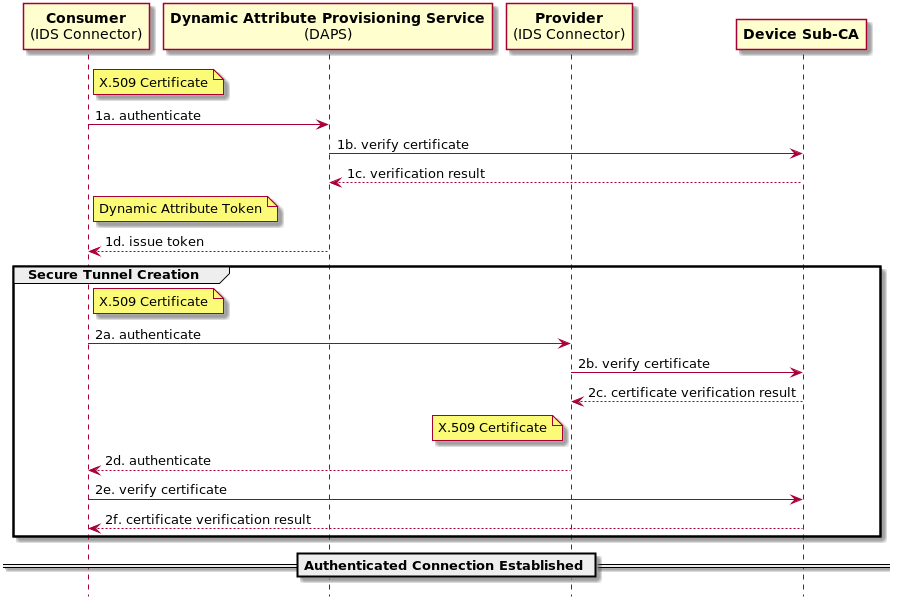
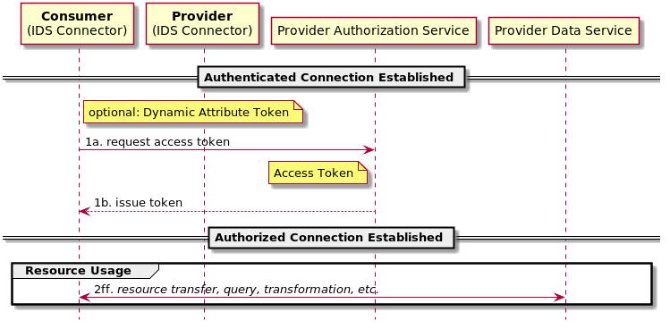
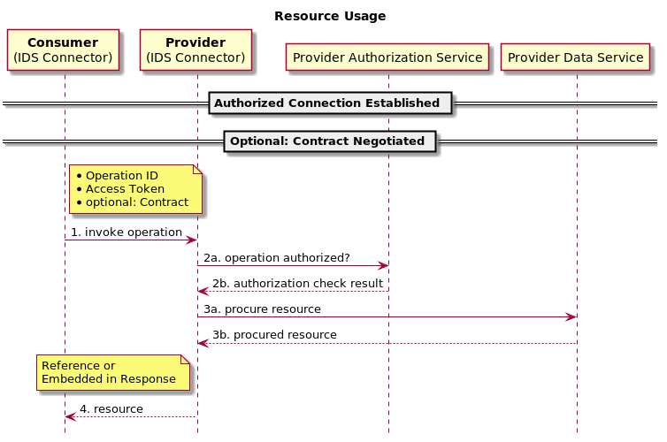
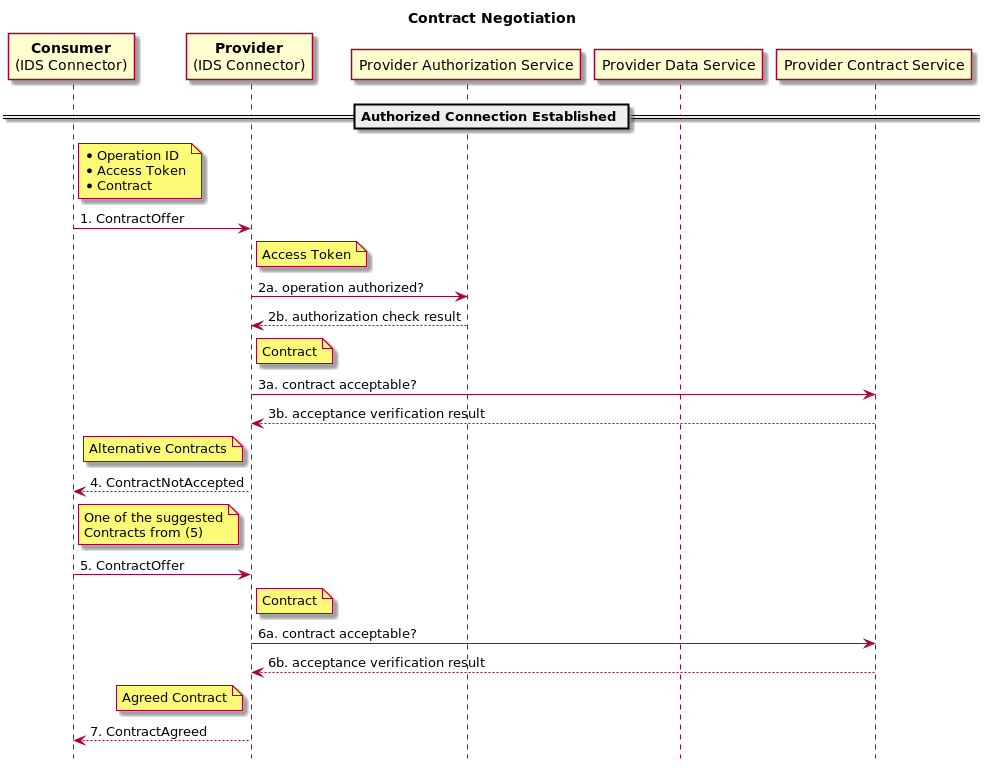
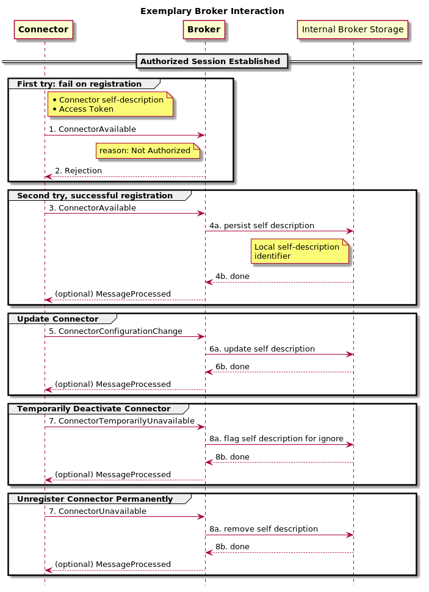

# Information Model - Communication Module
Information exchange between two IDS infrastructure components can be distinguished into two categories:

## Preliminaries
Participants on the IDS offer resources (data or apps) that they want to make accessible to other participants under
certain conditions. in order to do so, data providers need to publish a description about  
* the general nature of the resources (topic, ) 

## Payload Data Exchange
This category covers exchange of business data between two IDS participants. Each of them may have their own services
deployed, following specific (sometimes proprietary) protocols. 

While for many applications widely adopted de-facto
standards such as HTTP/REST and MQTT suffice, these are sometimes too limited or service reimplementation is too costly. Hence,
the information model does not impose any restrictions on how communication in this category should be done. However, participants
should strive for *describing* the protocols they used as exactly as possible using classes of the information model. The starting
point to do so is the ProtocolBinding class that spans a taxonomy of popular protocol implementations (currently formalized for
HTTP and MQTT but more will be added in future as needed).

**Example:** As a data provider, Alice wants to offer her annual business reports on the IDS as PDF file like this:

``http://alice.idsparticipant.com/connector/businessReport?year=2018``

**Solution:** She describes her Connector using the Information Model and defines the offered resource (=the business report), what
consumers can do with it (the retrieve operation), what parameters they need to provide in order to do that (=a year), what 
they would get (a PDF representation), and how this is implemented (as a HTTP call following a certain template).

### Annotated Data Transfers

payload data exchange is strictly bilateral (point-to-point). in order to support usage control, data is transfered from
a provider to a consumer must be accompanied (annotated) with metadata information to make the transfer traceable. fields of this metadata
structure are formalized in the class DataTransfer. examples are:
- sending and receiving component and sovereign 
- transfer initiation date
- payload signature
- underlying contract/policy

connector self-information describes how the metadata is added to the payload data. options are:
- no transfer annotation
- wrapping archive
- embedded (in the resource representation, e.g., image header)
- protocol specific
    - http: multipart or custom headers
    - mqtt: payload messages are correlated to data transfer metadata by the message ID which is shared via the topic identifiers
(similar to [implementing request/response for MQTT](http://www.bitreactive.com/blog/2014/09/24/mqtt-request-response/))

**TODO:** describe annotated communication (TransferHeader)    

## IDS Ecosystem Supportive Communication
All communication that belongs to this category has the goal to ensure that the IDS ecosystem can fulfill its promises such as 
providing a data market, establish trust, or ensure data sovereignty. Example use cases are:
- Connector registration at a Broker,
- Data synchronization across Brokers,
- Searching a Broker for matching data offers, 
- Resource usage contract/policy negotiations,
- Authentication and authorization.

In contrast to the "Payload Data Exchange" category, the IDS architecture and the information model *do* define how this
communication is performed. The use cases mentioned above are of diverse nature: some of them (e.g., connector registration)
may follow a synchronous request-response pattern. Others (e.g., contract negotiations) might require time-consuming processing
or even a human in the loop and are thus best addressed with an asynchronous approach.
In order to cover both information exchange paradigms, we follow a message-based approach. It can be both implemented in 
a synchronous way (the message sender blocks further processing until a certain response message is received) as well as
in an asynchronous way (the message sender continues with other tasks while his message is processed and until he is notified on 
the availability of the message's result).
Various protocols exist that support implementation of synchronous and asynchronous messaging approaches. On the IDS,
synchronous communication should be implemented via HTTP(S) and asynchronous communication via MQTT. Each infrastructure
component (e.g., Connector, Broker,...) may choose the type of communication it supports but must stick to these implementation
guidelines:

## Message Transport

The concept of messages allows us to formalize snippets of information exchange as a shared, linked data model (ontology). A taxonomy
and definition of all message types for ecosystem supportive communication on the IDS is available in the information model (file Model.ttl).
When it comes to transporting the messages from the sender to a receiver, these requirements need to be taken into account: 

1. Communication should be strictly bilateral (synchronously or asynchronous, e.g., contract negotiations, Connector registrations at a Broker)
2. Communicating partners don't know each other (e.g., a Broker communicates local updates to other Brokers)
3. Messages should be persisted (logging and clearing of all data exchange, compensate temporal unavailability of infrastructure components)

(1) and (2) have implications on the protocols used for message exchange and where the messaging infrastructure is deployed. These are described
in the following sections. Depending on the used implementations for (1) and (2), requirement (3) is either satisfied by the used messaging subsystem
or by a custom implementation. 

### Synchronous Message Exchange Implementation (bilateral)

To support synchronous message exchange, IDS components must expose the following method call on their HTTP API, allowing both
GET and POST requests and serializing input and return value as JSON:

```Optional<Message> process(Message input)```

``Message`` refers to the corresponding class as defined in the information model. An implementation of all information model
classes is available as Java library. 

**Example:** Alice runs a Broker and Bob wants to register his connector there, using synchronous messaging. Bob would
issue the following HTTP GET request:

``http://alice.idsparticipant.com/broker/process?input={"@type":"ConnectorRegistration","issuingConnector":"http://bob.participant.com/connector/","consumerConnector":"http://alice.participant.com/broker/",...}``

(for clarity we omitted proper encoding and shortened the JSON part in the above URL)

Note: This scenario can also be set up without a dedicated messaging service needs to be set up. As a result, however, the infrastructure component 
(e.g., Broker) is responsible for persisting the incoming and outgoing messages in case of future exploitation for, e.g., billing
purposes. As an alternative, for instance, such a REST-like interface can also be realized with off-the shelf messaging servers such as
[ActiveMQ](http://activemq.apache.org/rest.html). 
     
### Asynchronous Message Exchange Implementation (bilateral)

For use cases where an immediate reponse to a message cannot be ensured, communication must be done in an asynchronous way. On the IDS,
asynchronous messaging is done using MQTT. For bilateral communication, IDS infrastructure components that should be enabled for
asynchronous message exchange, need to offer a *local* messaging server that implements the MQTT protocol, e.g., an MQTT Broker (not to be 
confused with the IDS Broker). The necessary information about how to connect to this messaging server (URL, optional topic) need to
be provided by the infrastructure operator in the self-description of the infrastructure component.    

todo(cm): check useful default queues/topics

requirement: local mqtt broker installed (announced in connector self description)

MQTT topic name: default, fail

messaging middleware runs on the connector


### Asynchronous Message Exchange (1-to-n)

messaging middleware runs on a separate server; not implemented yet


## Establishing Data Exchange

### Enable Authenticated Communication

At first, a secure, encrypted communication channel must be established that ensures authentication of the communication partners. IDSCP
suggests the following workflow:



However, authenticated channels may also be established by using TLS in combination with, e.g., HTTP. In that case the above workflow
will take place implictly when requesting the access token (without presenting the dynamic attribute token, see next section).

### Ensure Authorized Access  

Based on an authenticated connection,  consumers need to request an access token in order to authorize for resource usage. The actual
method that must called to retrieve the token (step 1a) is stated in the connector's self description.



## Resource Usage

In order to use (download, query,...) a resource, consumers invoke a certain operation (as retrieved from the set of possible
operations from the connector's self description). Invoking the operation is done by creating a request as stated in the connector's
self description. That request depends on the provider's connector configuration and may be a http call, mqtt publication, a certain 
message type or others.  



Prior to invoke an operation to a resource, a contract for using the resource can be optionally negotiated. This is inititated by issuing
a ContractOffer message (defined in the IDS information model) to the resource provider's messaging endpoint. A workflow of a successful
contract agreement is depicted below.



## Broker Interaction

Information exchange with Broker instances is defined by a set of messages (see Section "Messages" below). Basis of each interaction is 
an established authorized connection, i.e. an access token is attached to each message. The case of registering a connector at a Broker 
with the means of a RegisterConnector message is depicted below.



## Messages

Certain infrastructure-relevant communication (such as, e.g, connector registration at brokers) is implemented by exchanging messages
of defined content. This section lists the specified messages and the type infrastructure components that must be able to accept and
interpret them.  

## List of message types by targeted infrastructure components 

"A _command_ is a message that expresses the intent to make a modification; if successful, it
results in an _event_, which is an immutable fact about the past. A _query_, on the other hand,
is a message that expresses the desire to obtain information and that may be answered
by a _result_ that describes an aspect of the domain object at the point in time when the
query was processed." (Reactive Design Patterns)

_rejections_ are responses to messages that are incorrect syntactically or content-wise. 

### General Message Structure

Each message is required to contain the following information (see the Information Model sources for further specification):
* String : modelVersion
* ??? issuingConnector -> @jaro: the ttl says the domain is ConnecotrIdentifier. Why can't this be URL?
* DateTime : issued

### General Messages
* RequestAccessToken

### Broker

This section names the message types that **must** be processed by any Broker implementation in order to be IDS compliant.

#### Connector Management Command

These messages deal with announcing information about IDS Connectors to the Broker. On message reception, the Broker **must** 
reply either with an Event or a Rejection Message. The rejection message references the command message by the correlation
id property. 

##### RegisterConnector
mandatory properties:
* String : connector self description 
OR
* URL : unique identifier of the connector 

##### UpdateConnector
mandatory properties: same as for RegisterConnector

##### UnregisterConnector
mandatory properties:
* URL : unique identifier of the connector

##### EnableConnector
mandatory properties: same as for UnregisterConnector

##### DisableConnector
mandatory properties: same as for UnregisterConnector

#### Events

For each Command message a corresponding Event message exists that is sent as a reply to the command. Their correlation 
id attribute must be set in order to reference the command message that caused the event. 

##### ConnectorRegistered, ConnectorUnregistered, ConnectorUpdated,...
mandatory properties:
* URL : correlation id (command message identifier)
* URL : connector 

#### Queries 

- GetWholeCatalog
- GetConnectorData
- QueryCatalog

#### Results

- CatalogResult

#### Rejections

- InvalidMessageFormat (e.g., signature missing, mandatory properties not included)
- NotAuthorized
- AuthorizationFailed
- TemporarilyUnavailable

### Connector

#### Resource Access Commands

When resources (e.g., Data Assets) are offered by the Connector 

- RequestResource (contains resource id)
- OfferResource (offers the transfer of a resource)

#### Contract Negotiation

- ContractOfferMessage
mandatory properties:
* URL : requested resource identifier
* String : offered contract (according to the infomodel, i.e., currently based on ODRL) 

#### Events

- ResourceRequestAccepted
mandatory properties:
* URL : resource identifier
* String : offered resource description (according to the infomodel) 

- ContractAgreement
mandatory properties:
* URL : identifier for which the contract has been negotiated
* String : description of the contract according to the infomodel

#### Queries

- GetSelfDescription
mandatory properties: none

- ContractRequestMessage
mandatory properties:
* URL : resource identifier for which the contract should be requested

#### Results

- SelfDescription
mandatory properties:
* String : self description according to infomodel

#### Rejections

- ContractNotAccepted (contains alternative offers of contracts)
optional properties:
List<String> : alternative contracts according to infomodel, each identified with an own (local) URL

- MalformedContract (contract misses information or is not compliant to a certain schema)
- TransferNotAuthorized

# Resources
- [DCAT GitHub-Wiki: Cataloguing data services](https://github.com/w3c/dxwg/wiki/Cataloguing-data-services)

